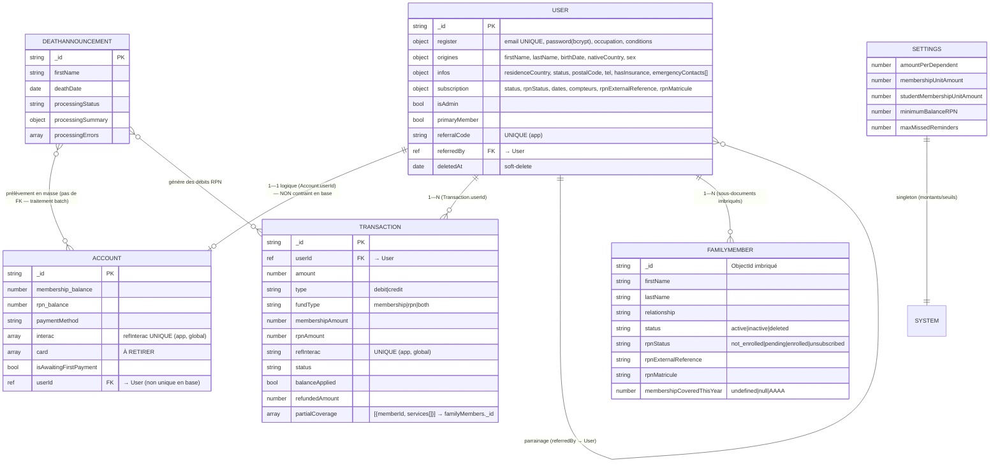
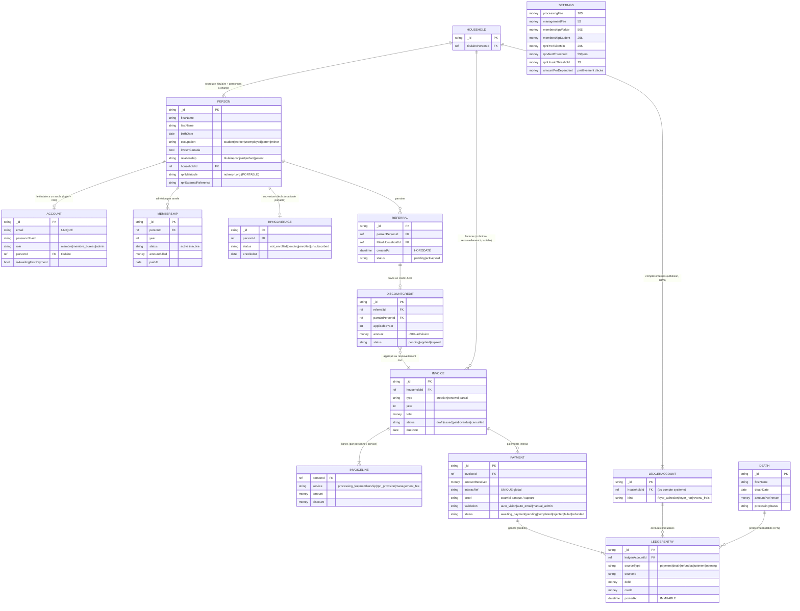

# FONCTIONNEL_WORKFLOWS — `mon-rpn-react`

> Documentation des **flux de bout en bout** qui traversent plusieurs modules, rôles ou entités —
> ce qu'une lecture module par module ([FONCTIONNEL_GLOBAL.md](FONCTIONNEL_GLOBAL.md)) ou page par
> page ([FONCTIONNEL_PAGES.md](FONCTIONNEL_PAGES.md)) ne capture pas. Références `fichier:ligne`
> issues du code serveur (`server/src/**`) et client (`client/src/**`). Les décisions du propriétaire
> (FONCTIONNEL_GLOBAL §0) priment sur le comportement « tel qu'implémenté ».

## Légende — états des entités principales

| Entité | Champ d'état | Valeurs |
|---|---|---|
| **Transaction** | `status` | `awaiting_payment` · `pending` · `completed` · `failed` · `rejected` · `refunded` (+ `success` legacy → normalisé `completed`) |
| **Transaction** | `balanceApplied` | `false` → `true` (idempotence de l'application au compte) |
| **Subscription** (adhésion) | `status` | `registered` · `active` · `inactive` (`expired` déclaré mais jamais assigné → à retirer) |
| **Subscription** (RPN) | `rpnStatus` | `not_enrolled` · `pending` · `enrolled` · `unsubscribed` |
| **DeathAnnouncement** | `processingStatus` | `pending` · `processing` · `completed` · `failed` |

---

## Workflow 1 — Inscription → compte en attente → premier paiement → activation

**Déclencheur** : un visiteur termine l'assistant d'inscription (étape 4 `/urgence`).

**Étapes**
1. **Étapes 1-3 (client, local)** — `Register`/`Origines`/`Infos` accumulent leur données, obtiennent un `tempToken` (`POST /api/users/generate-token`) et le
   vérifient (`POST /api/users/verify-token`).
2. **Création utilisateur** — `Urgence.logique.ts:212` → `POST /api/users/register` (`userRouter.ts:289`).
   Le serveur détecte les conflits (`registrationConflictService`), hache le mot de passe, génère un
   `referralCode` unique, persiste le `User` (`subscription.status` défaut `registered`, `rpnStatus`
   défaut `not_enrolled`).
3. **Compte « en attente de 1er paiement »** — `createAwaitingInteracAccount` (`Urgence.logique.ts:214`)
   → `POST /api/accounts/new` (`Account.isAwaitingFirstPayment=true`) + `POST /api/transactions/new`
   (transaction crédit initiale, `status=awaiting_payment` car sans `refInterac`, `transactionService.
   resolveStatusOnCreate:726-737`).
4. **Notifications** — `POST /api/users/send-password` (mot de passe généré envoyé au membre) +
   `POST /api/users/new-user-notification` (alerte admin).
5. **Onboarding** — dialogue `NextStepsDialog` : « Ajouter la famille » (→ `/profil/dependents? onboarding=1`)
    ou « Je suis seul » (→ URL de paiement `both`). Tant que `isAwaitingFirstPayment`,
   `useAwaitingFirstPaymentRedirect` confine l'utilisateur aux pages dependents/billing.
6. **Paiement + activation** — voir **Workflow 2** (le membre soumet un dépôt Interac, l'admin valide,
   `apply()` crédite le compte, active l'adhésion et déclenche l'inscription RPN en appelent le système externe notrerpn.org).

**États & transitions (entité pivot : `Account.isAwaitingFirstPayment` + `Subscription.status`)**
- `Account` créé `isAwaitingFirstPayment=true` ; `Subscription.status=registered`.
- Après confirmation admin du 1er paiement contenant du membership → `isAwaitingFirstPayment=false`
  (`transactionService.ts:535`), `subscription.status=active` (`activateMembership:875`).

**Rôles** : Visiteur (initie), Système (crée user/compte/transaction, envoie courriels), Admin
(valide le paiement en Workflow 2).

**Points de sortie/échec**
- Conflit d'inscription (email ou nom+téléphone déjà présents) → 409, toast, aucune création de doublon
  (`registrationConflictService.ts:83-104`). En effet cela évite d'avoir des doublons de personne identique comme personne à charge ou principale.
- Jeton temporaire absent/invalide → toast bloquant (`Urgence.logique.ts:167-188`).
- Échec après `register` mais avant `createAccount`/`sendPassword` : l'utilisateur peut être créé
  **sans compte** ni courriel de mot de passe (étapes séquentielles non transactionnelles) → état
  intermédiaire persistant.

**Comportement attendu (reformulé)** : la création « utilisateur + compte + transaction initiale +
envoi du mot de passe » DOIT être **atomique ou compensée** : en cas d'échec partiel, soit tout est
annulé, soit une reprise idempotente garantit qu'un utilisateur inscrit possède toujours un compte et
reçoit ses identifiants (aujourd'hui 4 appels réseau séquentiels sans compensation,
`Urgence.logique.ts:212-248`). Le rôle `isAdmin` DOIT être forcé à `false` côté serveur
(`userRouter.ts:289` accepte le corps client).

---

## Workflow 2 — Dépôt Interac → validation admin → application au compte (cycle transactionnel)

**Déclencheur** : le membre soumet un paiement sur `/billing` ou `/billing-partiel` (ou la transaction
initiale de l'inscription).

**Étapes**
1. **Création** — `POST /api/transactions/new` → `transactionDomainService.create` (`transactionService.ts:346`).
   Contrôle d'unicité de la référence Interac (`interacReferenceService.interacRefExists`), calcul du
   statut initial : crédit avec `montant>0` + `refInterac` → `pending` ; sinon → `awaiting_payment`.
   `ensureAccountAfterCreate` ajoute la ligne Interac et positionne `isAwaitingFirstPayment`.
2. **Attente de vérification** — l'admin voit la transaction `pending` dans `/admin/transactions`.
3. **Décision admin** :
   - **Confirmer** (`POST /api/transactions/:id/confirm`) → `PendingState.confirm` → `apply()`
     (`transactionService.ts:508`) : crédite `membership_balance`/`rpn_balance`,
     `isAwaitingFirstPayment=false`, `paymentMethod='interac'` ; si `membershipAmount>0` →
     `activateMembership` (statut adhésion `active`, `membershipCoveredThisYear=année`, courriel
     succès) ; si `rpnAmount>0` → `markMembersRpnPending` + `onRpnPaymentConfirmed` (**Workflow 4**).
     `status=completed`, `balanceApplied=true`.
   - **Rejeter** (`.../reject`) → `rollbackAppliedCredit` (décrémente les soldes) + `status=rejected`
     + courriel « paiement rejeté ».
   - **Échec** (`.../fail`) → `rollbackAppliedCredit` + `status=failed` (pas de courriel).
   - **Process** (`.../process` outcome completed|failed) → confirm ou fail.

**États & transitions (entité pivot : `Transaction.status`)**
```
awaiting_payment ──(admin ne peut pas "process": doit d'abord passer pending)──► [bloqué 409]
pending ──confirm──► completed        (apply: crédite compte + active adhésion + enrôle RPN)
pending ──reject───► rejected         (rollback des crédits, courriel)
pending ──fail─────► failed           (rollback des crédits)
completed ──refund─► refunded         (RPN uniquement, total/partiel — Workflow 8)
failed | rejected | refunded ─────────► [états finaux, transitions 409]
```

**Rôles** : Membre (initie le dépôt), Admin ou le système via claude vision(confirme/rejette/échoue/rembourse), Système (applique les
effets, envoie les courriels).

**Points de sortie/échec**
- Référence Interac déjà utilisée → 400 à la création (`transactionService.ts:351-357`).
- `apply()` est **idempotent** (`balanceApplied===true` → skip, `:517-520`).
- `rollbackAppliedCredit` ne **rétablit que les soldes** — il n'annule ni l'activation d'adhésion ni
  l'inscription RPN déjà déclenchées (`transactionService.ts:578-611`).
- Le prélèvement décès (**Workflow 5**) **contourne** cette machine à états (débit direct `$inc`).

**Comportement attendu (reformulé)**
- Le rejet/échec d'un crédit déjà appliqué DOIT annuler **tous** ses effets (soldes **+** activation
  adhésion **+** inscription RPN), pas seulement les soldes (`transactionService.ts:578-611`).
- **(Décision 2026-07-05)** La **voie principale** de validation est **automatique** : le membre
  fournit sa **preuve de paiement** (courriel/capture de sa banque) que **Claude Vision** analyse et
  valide comme le ferait un admin (`process → completed`) ; la **validation manuelle admin** devient la
  **voie de secours** en cas de problème.
- **(Décision 2026-07-05)** Le montant envoyé DOIT être **≥ total attendu**, sinon la transaction est
  **refusée** ; tout **surplus est affecté au solde RPN** (ex. attendu 45$ = 25$ adhésion + 20$ RPN,
  reçu 55$ → 25$ adhésion + 30$ RPN). Le total attendu est **recalculé côté serveur**.
- Les montants DOIVENT accepter des **décimales** (ex. 12,50 $) avec une arithmétique au cent (éviter
  les flottants).

---

## Workflow 3 — Cotisation annuelle (prélèvement automatique) → désactivation des inactifs

**Déclencheur** : cron `0 10 * 1 0` (dimanches de janvier 10h, `cron/membershipReminder.ts:9`) →
`processAnnualMembershipPayment()`. Variante manuelle admin : `POST /api/transactions/manual-reminders`
(batch) ou `POST /api/transactions/manual-payment/:userId` (unitaire → `processMembershipForUser`).

**Étapes**
1. Pour chaque `User` donc l'adhésion est active : saute si déjà payé cette année (`lastMembershipPaymentYear===année
   && membershipPaidThisYear`, `membershipService.ts:85-89`).
2. Calcul du dû (`calculateMembershipAmount:30-75`) : personnes ≥ 18 ans, `status active`, tarif
   étudiant/travailleur/sans emploi, parents résidents au tarif étudiant.
3. Si `membership_balance ≥ dû` → débit du solde, transaction `debit/completed`, courriel succès,
   `subscription.status=active`, dates + `membershipCoveredThisYear=année`.
4. Sinon → après le delais de fin février `handleFailedPrelevement` (`subscriptionService.ts`)
   : `missedRemindersCount++` ; au 1er
   échec, transaction `debit/failed`, **`scheduledDeactivationDate = +60 jours`** (`:31`), courriel
   d'avertissement ; courriel « prélèvement échoué » et désactivation de l'adhésion.
5. **Cron de désactivation** `0 5 * * *` (quotidien, `:21`) → `processInactiveUsers` : tout `User`
   `status ∈ {active, registered}` avec `scheduledDeactivationDate ≤ maintenant` → `status=inactive` +
   courriel `sendAccountDeactivatedEmail`. À la connexion, `isAuth` bloque un compte inactif (403,
   `utils.ts:98-102`) et le front redirige vers `/account-deactivated`.

**États & transitions (entité pivot : `Subscription.status`)**
```
registered/active ──prélèvement réussi──► active (dates + année payées)
active ──date de prélèvement──► fin février
(scheduledDeactivationDate ≤ now) ──cron 5h──► inactive
inactive ──réactivation manuelle admin──► active (Workflow 9)
```

**Rôles** : Système (cron), Admin (déclenche manuellement, réactive), Membre (subit).

**Points de sortie/échec**
- Aucun compte (`AccountModel`) pour l'utilisateur → utilisateur ignoré (`membershipService.ts:98-99`).

**Comportement attendu (reformulé)**
- Les délais et compteurs d'adhésion et de RPN DOIVENT être **indépendants** (champs de date/compteur
  distincts) : une insuffisance RPN ne doit pas désactiver l'adhésion et inversement
  (`subscriptionService.ts:31` vs `rpnLifecycleService.ts:283`, champ commun
  `subscription.scheduledDeactivationDate`).
- L'unique source du barème (montants, seuils, `maxMissedReminders`) DOIT être les **paramètres
  serveur** avec une valeur par défaut unique.
- **(Décision 2026-07-05 — correction du modèle)** Le renouvellement DOIT être **facturé, pas
  prépayé** : le système **génère une facture annuelle** = **5 $/personne active (gestion) + l'adhésion
  selon la profession** ; il **n'auto-prélève pas** un solde constitué d'avance. Une **période de
  rappels d'environ 2 mois** (janvier → **mi-février**) précède l'échéance ; sans **paiement réel**,
  le foyer est **désactivé et désinscrit du RPN**. La **réactivation** exige un **paiement réel** (ou
  une exonération tracée) — plus d'octroi automatique d'année (`membershipService.ts:285-286`).
- **(Décision 2026-07-05 — mise à jour des professions)** Au **renouvellement**, le système DOIT
  **revalider les professions** : à **2 ans**, redemander le statut des étudiants ; après **5 ans**,
  un étudiant devient **automatiquement travailleur**, **sauf** médecine ou doctorat.

---

## Workflow 4 — Confirmation d'un paiement RPN → inscription/synchronisation sur notrerpn.org

**Déclencheur** : `apply()` d'une transaction crédit contenant du RPN (`transactionService.ts:557-564`)
→ `onRpnPaymentConfirmed(userId, nouveauSoldeRpn)` (`rpnLifecycleService.ts:122`). Variantes : sync
manuelle admin (`POST /api/users/admin/rpn-sync/:userId`, `/retry-rpn-family/:memberId`), opt-in
volontaire (`PATCH /api/users/:id/rpn-primary`).

**Étapes**
1. Seuil : si `nouveauSolde < totalPersonnes × minimumBalanceRPN` → rien (`rpnLifecycleService.ts:136-139`).
   `totalPersonnes` = principal + personnes à charge dont `rpnStatus ∉ {not_enrolled, unsubscribed}`
   (`utils.calculateTotalPersons:175-188`).
2. Aiguillage selon `subscription.rpnStatus` :
   - `not_enrolled`/`null` → `enrollRpnMember` (`:164`) : MAJ atomique → `enrolled`, pré-marque les
     personnes à charge actives sans référence en `pending`, appelle `enrollOnExternalPlatform`
     (notrerpn.org `POST /members`), persiste `rpnExternalReference`/`rpnMatricule`, puis inscrit les
     personnes à charge en attente (`enrollPendingFamilyMembers`).
   - `unsubscribed` → `reactivateRpnMember` (`:223`) : `enrolled`, réactivation externe, courriel.
   - `enrolled` + référence présente → inscrit les personnes à charge encore `pending`.
   - `enrolled` **sans** référence → avertissement, inscription famille impossible (`:154-156`).
3. Chaque personne inscrite : `rpnStatus=enrolled` + `rpnExternalReference`/`rpnMatricule` persistés.

**États & transitions (entité pivot : `rpnStatus`, principal et par personne à charge)**
```
not_enrolled ──paiement RPN validé──► enrolled ──(sync externe OK)──► + rpnExternalReference/matricule
enrolled ──opt-out volontaire / statut famille inactive / soldes insuffisants (max rappels)──► unsubscribed
unsubscribed ──paiement RPN validé / opt-in──► enrolled (réactivation externe)
pending (personne à charge marquée, en attente d'inscription externe) ──sync OK──► enrolled
```

**Rôles** : Membre (paie, opt-in/opt-out via `/profil/couverture`), Système (enrôle/synchronise),
Admin (sync manuelle, relance des blocages via `/admin/relancer-rpn-en-echec`), notrerpn.org (plateforme
externe).

**Points de sortie/échec**
- Appels externes en **fire-and-forget** (`.then().catch`) : si `POST /members` échoue, le principal
  reste `enrolled` en base **sans** `rpnExternalReference`, ce qui **bloque** l'inscription des
  personnes à charge (`rpnLifecycleService.ts:194-214, 154-156`). Un courriel est envoyé à l'admin ;
  la relance se fait via `/admin/relancer-rpn-en-echec`.
- Race conditions gérées par MAJ atomiques conditionnelles (`updateOne` avec filtre de statut).

**Comportement attendu (reformulé)** : le principal NE DOIT passer `enrolled` en base **qu'après**
confirmation de la référence externe (ou via un état `pending` explicite), afin de ne jamais laisser un
principal `enrolled` sans référence ; les appels notrerpn.org DOIVENT être **fiabilisés** (attente,
retry, idempotence, file persistée) plutôt que fire-and-forget (`rpnLifecycleService.ts:149-214`).

---

## Workflow 5 — Annonce de décès → prélèvement en masse du fonds RPN

**Déclencheur** : admin publie une annonce sur `/admin/announcements` → `POST /api/announcements/new`
(ou `/batch`) → `createDeathAnnouncement` + `queueDeathAnnouncementProcessing`
(`deathAnnouncementService.ts:358,382`).

**Étapes**
1. Création de l'annonce : `processingStatus=pending` si `amountPerDependent>0`, sinon `failed`
   (`:358-380`).
2. File **sérialisée en mémoire** (`_processingChain`) → `processDeathAnnouncement` (`:417`) :
   `pending → processing`.
3. Cible : tous les `User` `primaryMember:true` ayant une couverture décès. Pour chacun :
   `dû = totalPersonnes × amountPerDependent`.
4. Partition : solde RPN suffisant → **débit en masse** `AccountModel.bulkWrite($inc rpn_balance)` +
   `TransactionModel.insertMany` (`debit/rpn`, statut défaut `completed`) (`applyDebitCandidates:259-286`).
   Solde insuffisant → `onRpnBalanceInsufficient` (concurrence 5) : `missedRpnRemindersCount++` ; au
   1er échec, transaction `debit/failed` + **`scheduledDeactivationDate=+7j`** + courriel ; à
   `maxMissed` → `unsubscribeFromRpn` (désinscription externe notrerpn.org).
5. Notification à tous les membres (`notifyUsersForDeathAnnouncement`), récap (`processingSummary`),
   `processing → completed` (ou `failed`).
6. Le front (`/admin/announcements`) **poll** toutes les 4 s tant que `pending`/`processing`.

**États & transitions (entité pivot : `DeathAnnouncement.processingStatus`)**
```
pending ──amountPerDependent absent──► failed
pending ──mise en file──► processing ──succès──► completed
processing ──exception──► failed (raison enregistrée)
completed ──(idempotent, ré-exécution ignorée deathAnnouncementService.ts:421-423)
```

**Rôles** : Admin (publie), Système (débite, notifie, désinscrit), Membre (subit le prélèvement /
la désinscription RPN), notrerpn.org (désactivation externe).

**Points de sortie/échec**
- File **en mémoire** → perdue au redémarrage du serveur (aucune reprise).
- Décision suffisant/insuffisant prise sur un **instantané** des soldes (`accountMap`) — un débit
  concurrent (ex. cotisation) pourrait rendre la décision obsolète.
- Chemin monétaire **parallèle** à la machine à états (débit direct sans `balanceApplied`).
- `maxMissed` par défaut `?? 3` ≠ modèle `5` (`deathAnnouncementService.ts:481`).

**Comportement attendu (reformulé)**
- La file de traitement DOIT être **persistée et reprenable** après redémarrage, idempotente, avec un
  journal d'exécution (`_processingChain` en mémoire, `:46,382`).
- Tous les mouvements d'argent (y compris le prélèvement décès) DOIVENT emprunter le **chemin
  transactionnel unique** appliquant `balanceApplied` et les invariants (`applyDebitCandidates:259-286`
  contourne `transactionService`).
- La désinscription RPN pour soldes insuffisants NE DOIT PAS partager le champ/délai de désactivation
  de l'adhésion (voir Workflow 3).
- **(Décisions 2026-07-05)** :
  - **Aucune preuve** de décès à joindre côté application : les décès proviennent du **RPN central
    `notrerpn.org`** (source de vérité).
  - La désinscription pour insuffisance est **immédiate** dès que le solde RPN tombe **à `1$` ou moins**
    (courriel envoyé) — remplace la logique « compteur `maxMissed` » (`onRpnBalanceInsufficient`). Les
    **personnes à charge sont désinscrites** avec le foyer, qui peut **se régulariser rétroactivement**.
  - Un solde RPN devenu **négatif** après un prélèvement fait **office de dette** à rembourser.
    En effet, à la prochaine recharge, on compense d'abord le manque avant de débuter les prélèvements.
  - **Équité assumée** : une grande famille contribue davantage (par personne couverte).

---

## Workflow 6 — Solde RPN bas → rappel (et éventuelle désinscription)

**Déclencheur** : cron `0 9 * * 0` (dimanches 9h) **actuellement désactivé** (`cron/membershipReminder.ts:14-19`,
à réactiver §0) → `checkMinimumBalanceAndSendReminder`. Variante manuelle admin :
`POST /api/transactions/manual-balance-reminder/:userId` → `sendBalanceReminderIfNeeded`.

**Étapes**
1. `min = totalPersonnes × minimumBalanceRPN`.
2. Cron (passif) : si `rpn_balance ≤ min` → `sendLowBalanceNotification` (courriel), **sans** compteur
   ni désinscription (`checkMinimumBalanceAndSendReminder.ts:10-33`).
3. Manuel (actif) : `sendBalanceReminderIfNeeded` → `onRpnBalanceInsufficient` (compteur +
   désinscription à `maxMissed`) ; le courriel `sendLowBalanceNotification` y est **commenté**
   (`:60-65`).

**Rôles** : Système (cron), Admin (rappel manuel), Membre (destinataire).

**Points de sortie/échec** : deux comportements divergents pour « solde bas » (cron = courriel seul ;
manuel = cycle de vie complet).

**Comportement attendu (reformulé)** — **(Décision 2026-07-05)** : le rappel de solde RPN bas est
**purement informatif** et s'exécute **chaque samedi** (hebdomadaire) pour les foyers dont le solde est
`≤ 5$/personne` (seuil de sécurité en cas de décès multiples). Il **n'incrémente aucun compteur** et ne
désinscrit pas — la **désinscription est un mécanisme distinct**, déclenché à `≤ 1$` (Workflow 5).

---

## Workflow 7 — Ajout d'une personne à charge en cours d'année → facturation partielle

**Déclencheur** : le membre ajoute/active une personne à charge après avoir déjà payé l'année
(`/profil/dependents`).

**Étapes**
1. `PUT /api/users/:id` (`userRouter.ts:396`) : si `membershipPaidThisYear` et le membre est
   facturable et `membershipCoveredThisYear===undefined` → marqué `null` (« en attente de couverture »,
   `userRouter.ts:432-434`).
2. La personne apparaît dans `usePartialBillingMembers` → visible sur `/billing-partiel` et signalée
   par `UncoveredMembersAlert` / lien dans `/profil/couverture`.
3. Paiement `/billing-partiel` → `POST /api/transactions/new` (`fundType`, `partialCoverage`,
   `status=pending`).
4. Confirmation admin → `apply()` → `activateMembership(userId, montant, partialMemberIds)` ne couvre
   **que** les membres ciblés (`transactionService.ts:886-895`) → `membershipCoveredThisYear=année` ;
   si RPN sélectionné → `markMembersRpnPending` + Workflow 4.

**États & transitions (entité pivot : `FamilyMember.membershipCoveredThisYear`)**
```
undefined (legacy) ──MAJ après paiement annuel──► null (en attente)
null ──facturation partielle confirmée──► AAAA (couvert)
```

**Rôles** : Membre (ajoute + paie), Admin (confirme), Système (marque la couverture).

**Points de sortie/échec** : si la transaction partielle est rejetée, la personne reste `null` (non
couverte) — cohérent.

**Comportement attendu (reformulé)** — **(Décisions 2026-07-05)** :
- Une personne à charge **ajoutée en cours d'année** est facturée au **tarif de création** (10 $
  traitement + adhésion profession + provision RPN ≥ 20 $), pas au tarif de renouvellement.
- **Retrait** d'une personne à charge (suppression / désactivation / non-renouvellement) → **désinscription
  `notrerpn.org`** ; son **montant RPN restant est conservé** dans le fonds du foyer s'il reste des
  membres actifs (ou pour le titulaire), **sinon remboursé**.
- Unifier les règles d'éligibilité entre serveur (`calculateMembershipAmount`) et client
  (`useFullBillingMembers`/`usePartialBillingMembers`/`familyMemberRules`) pour éviter les divergences.

---

## Workflow 8 — Remboursement d'une transaction (RPN)

**Déclencheur** : admin clique « Rembourser » sur `/admin/transactions` (transaction `completed`,
`fundType ∈ {rpn, both}`).

**Étapes** : `POST /api/transactions/:id/refund` → `refundCompletedTransaction`
(`transactionService.ts:621`) : plafond = `rpnAmount − déjàRemboursé` ; décrémente `rpn_balance` ;
`refundedAmount += montant` ; `status=refunded`. La partie adhésion n'est **jamais** remboursable.

**États & transitions** : `completed → refunded` (partiel ou total ; un remboursement partiel laisse
tout de même `status=refunded`, cf. reformulation).

**Rôles** : Admin (initie), Système (applique).

**Points de sortie/échec** : déjà totalement remboursé → 409 ; montant > restant → 409 ; montant ≤ 0 →
400.

**Comportement attendu (reformulé)** : distinguer clairement **remboursement partiel** et **total** —
un remboursement partiel passe aujourd'hui la transaction en `refunded` (état final, plus d'action
possible), ce qui empêche un second remboursement partiel ultérieur (`transactionService.ts:677`).

---

## Workflow 9 — Désactivation / réactivation / suppression d'un compte (admin)

**Déclencheur** : admin sur `/admin/accounts` (boutons) ou cron (désactivation auto, Workflow 3).

**Étapes**
- **Désactiver** : `PUT /api/users/deactivate/:id` → `desactivateUserAccount` → `status=inactive` +
  courriel.
- **Réactiver** : `PUT /api/users/reactivate/:id` → `reactivateUserAccount` → `status=active`,
  compteurs remis à 0, **et `membershipPaidThisYear=true` + `lastMembershipPaymentYear=année` sans
  paiement réel** (`membershipService.ts:285-286`).
- **Basculer admin** : `PUT /api/users/admin/:id` → inverse `isAdmin`.
- **Supprimer** : `DELETE /api/users/:id` → `softDeleteUser` → `deletedAt`/`deletedBy` (refusé si le
  compte est admin, `userService.ts:8-10`).

**Rôles** : Admin uniquement.

**Points de sortie/échec** : suppression d'un admin refusée (400). Le soft-delete conserve les
transactions/compte associés.

**Comportement attendu (reformulé)** : la réactivation NE DOIT accorder une année payée que si un
paiement existe (ou via une exonération admin **explicitement tracée**), pas automatiquement
(`membershipService.ts:285-286`).

---

## Workflow 10 — Parrainage

**Déclencheur** : inscription via `/register/:id/:ref` (lien de parrainage).

**Étapes** : `referralId`/`referralCode` stockés en `localStorage` (étape 1) → envoyés comme
`referredBy` à `POST /api/users/register` → `User.referredBy` (référence vers un autre `User`) +
`referralCode` unique généré (`utils.generateUniqueReferralCode:143-162`). Le parrain consulte ses
filleuls sur `/profil/sponsorship` (`GET /api/users/:referredBy/referral`).

**États & transitions** : aucune machine à états ; relation persistante `referredBy`.

**Rôles** : Filleul (s'inscrit via lien), Parrain (consulte).

**Points de sortie/échec** : code de parrainage non résolu → simple absence de lien parent.

**Comportement attendu (reformulé)** — **(Décision 2026-07-05 — NOUVELLE fonctionnalité, absente du
code)** : le parrainage DOIT accorder une **réduction de 50 % sur l'adhésion du parrain** au
**renouvellement de l'année suivante**, **conditionnée** au fait que le **filleul soit devenu actif
(a payé)**.
- Réductions **cumulables** par filleul actif, applicables jusqu'au **maximum des adhésions du foyer**
  du parrain (personnes à charge incluses) ; -50 % de l'adhésion = **12,5$ / 12,5$ / 25$** selon la
  profession.
- **Non reportable** au-delà d'un an, **non rétroactive** (filleul payé après le renouvellement →
  avantage reporté à l'année suivante) ; parrainages **horodatés** pour déterminer l'année d'éligibilité.
- Le parrain **voit ses filleuls et le montant de réduction prévu** ; la réduction est **appliquée
  automatiquement** à la génération de la facture de renouvellement (Workflow 3).
- L'**administration peut corriger/annuler** un parrainage ; un filleul désinscrit / non payé →
  **aucune réduction**.

---

## Workflow 11 — Promotion d'une personne à charge en titulaire (NOUVEAU)

**Déclencheur** *(à concevoir — inexistant aujourd'hui)* : **un administrateur** promeut une personne à
charge (enfant devenu adulte, conjoint séparé) en titulaire. **(Décision 2026-07-05 : opération réservée
à l'admin et effectuée par l'admin ; le membre ne la fait pas seul.)**

**Étapes (cible)**
1. L'admin sélectionne la personne à charge à détacher du foyer d'origine.
2. Création d'un **nouveau titulaire** (`Person` + `Account`) reprenant son identité.
3. **Couverture RPN** : la personne **conserve son `rpnMatricule` `notrerpn.org` et sa couverture si
   elle est active**, **mais son solde RPN NE suit PAS** — le nouveau foyer **repart à 0 $** et doit
   **re-provisionner 20 $ minimum** pour rester couvert.
4. Le **titulaire d'origine cesse de payer/porter** cette personne.

**États & transitions** : `Person` (à charge, couverte) → **nouveau titulaire** (matricule/couverture
conservés, **solde RPN = 0 $**). L'**historique n'est PAS transféré**.

**Rôles** : **Admin** (initie et valide), Système (crée le compte, conserve le matricule RPN).

**Points de sortie/échec** : le nouveau foyer démarre à **0 $** ; sans re-provision de 20 $, la
couverture RPN retombe (règle des seuils, Workflow 5).

**Comportement attendu (reformulé)** : parcours **admin** de détachement conservant identité et
**matricule RPN**, **sans** transfert d'historique ni de solde, l'ancien foyer cessant de la porter.

---

## Workflow 12 — Rôles & exemptions (Membre du bureau / Admin)

**Déclencheur** : un admin attribue le rôle **Membre du bureau** (ou **Admin**) à un membre.

**Règles d'affaire (décidées 2026-07-05)**
- **Membre du bureau** *(rôle NOUVEAU)* : **exempté de la cotisation d'adhésion** pour lui et sa
  famille, **PAS du RPN** — il **contribue aux décès** et **perd la couverture si son solde RPN < 1$**.
  Peut **publier rapports/activités**. Pas de pouvoirs d'administration.
- **Admin** : mêmes exemptions (adhésion oui, RPN non) + tous les pouvoirs d'administration.
- **Suppression de compte** : effet **cascade** + **désinscription `notrerpn.org`**, mais **archivage**
  des données financières à des fins d'**audit** (un admin ne peut être supprimé).

**Comportement attendu (reformulé)** : le calcul de facturation DOIT **exempter d'adhésion** les rôles
Membre du bureau / Admin (eux + famille) **tout en les soumettant au RPN** ; le RBAC DOIT gérer le
**nouveau rôle « membre du bureau »** (attribué par un admin, distinct d'admin).

---

## 3. Schéma de données global (ERD)

> Le `User` est un **document racine** avec des sous-documents imbriqués (`register`, `origines`,
> `infos`, `subscription`, `familyMembers[]`). Les `_id` de `familyMembers` sont des ObjectId imbriqués
> (non des collections séparées). `Reservation` est **hors périmètre** (module à retirer).



### Relations
| Relation | Cardinalité | Support |
|---|---|---|
| User → Account | 1—1 (attendu) | `Account.userId` (réf). **Non unique en base** : le code lit « le dernier compte » (`accounts[accounts.length-1]`, `ProtectedRoute.tsx:18`) → doublons possibles. |
| User → Transaction | 1—N | `Transaction.userId` (réf). |
| User → FamilyMember | 1—N | Sous-documents imbriqués (`familyMembers[]`). |
| User → User | 1—N (parrainage) | `User.referredBy` (réf auto). |
| Transaction.partialCoverage → FamilyMember | N (par `memberId`) | Référence **par valeur** vers `familyMembers._id` (pas de FK). |
| DeathAnnouncement → Account/Transaction | N—N implicite | Traitement batch, aucune FK. |

### Contraintes d'intégrité transversales
| Contrainte | Où appliquée aujourd'hui | Reformulation (nouvelle app) si absente/fragile |
|---|---|---|
| **Unicité `register.email`** | Index unique en base (`userModel.ts:75`) **+** contrôle applicatif (`registrationConflictService`) | OK — conserver l'unicité BD + message neutre côté flux mot de passe oublié. |
| **Unicité réf. Interac (globale, comptes + transactions)** | **Applicative uniquement** (`interacReferenceService.interacRefExists`) | DOIT être garantie de façon fiable (index/contrainte ou vérification transactionnelle), pas seulement par un `findOne` best-effort. |
| **Unicité `referralCode`** | Applicative (`generateUniqueReferralCode`, 10 essais) | Ajouter un index unique en base pour éliminer toute collision résiduelle. |
| **Un seul `Account` par `User`** | **Non appliquée** (lecture du « dernier » compte) | DOIT être une contrainte 1—1 stricte (index unique sur `Account.userId`) pour supprimer les doublons de comptes/soldes. |
| **`membershipAmount + rpnAmount == amount` (fundType=both)** | Applicative (`transactionService.ts:1023-1034`) | Conserver comme invariant validé serveur. |
| **Idempotence d'application (`balanceApplied`)** | Applicative (`transactionService.ts:517-520`) | Conserver ; l'étendre au prélèvement décès (chemin unique). |
| **`rpnExternalReference` présent avant inscription des personnes à charge** | Applicative fragile (fire-and-forget) | Rendre l'enrôlement fiable/transactionnel (Workflow 4). |
| **Cohérence « personnes couvertes RPN » vs « facturées adhésion »** | Deux logiques divergentes (`utils.calculateTotalPersons` ignore `status` ; `calculateMembershipAmount` exige `status active`) | Définir des critères **uniques et explicites** combinant `status` et `rpnStatus`. |
| **Cascade sur soft-delete `User`** | Partielle (les requêtes filtrent `deletedAt`) ; Account/Transaction non purgés | Définir explicitement le sort des `Account`/`Transaction` d'un utilisateur supprimé (conservation historique vs anonymisation). |
| **Suppression de compte admin interdite** | Applicative (`userService.ts:8-10`) | Conserver. |

### Nouveaux besoins de modèle (décisions 2026-07-05)
- **Rôle utilisateur** : remplacer le booléen `isAdmin` par un **rôle** `membre | membre_bureau | admin`
  (le membre du bureau est exempté d'adhésion, pas du RPN).
- **Parrainage-réduction** : horodater chaque parrainage et suivre l'**état du filleul** (payé/actif)
  pour calculer la réduction ; conserver le **crédit de réduction** rattaché au renouvellement N+1 du
  parrain (cumulable, plafonné au total des adhésions du foyer, non reportable > 1 an).
- **Facturation par facture** : introduire une **facture de renouvellement** (émise, payée réellement)
  distincte du solde d'adhésion prépayé — le renouvellement n'est plus un auto-prélèvement.
- **Seuils RPN** : deux seuils distincts — **alerte** à 5$/personne, **désinscription** à ≤ 1$.
- **Promotion personne à charge → titulaire** : prévoir la **portabilité** de la référence/matricule RPN.
- **Archivage** : conserver (auditer) les données financières d'un compte supprimé plutôt que purge.

---

## 3bis. Schéma de données CIBLE (refonte domaine + grand livre) — décision 2026-07-05

> **Décision** : la nouvelle application **ne reprend pas** le modèle legacy imbriqué (§3). Elle est une
> **refonte orientée domaine** sur **MongoDB Atlas** (Mongoose/Typegoose, **pas Prisma**), avec des
> **entités de premier plan référencées** et un **grand livre en partie double** (soldes dérivés). Le
> modèle §3 reste documenté comme **source de la migration** (Phase 9). *Points « à valider » signalés
> plus bas.*



### Principes du modèle cible
- **`Personne` = entité de premier plan** (plus un sous-document). Elle porte sa **couverture RPN** et
  son **matricule notrerpn.org** → permet la **promotion en titulaire** (rattacher la personne à un
  nouveau `Household` + `Account`, matricule conservé) et la **couverture indépendante par personne**.
- **`Account`** = accès de connexion + **rôle** (`membre|membre_bureau|admin`) — remplace le booléen
  `isAdmin` ; un seul par titulaire.
- **Soldes dérivés** : le « solde adhésion » et le « solde RPN » d'un foyer = **somme des écritures**
  de ses `LedgerAccount` (`foyer_adhesion`, `foyer_rpn`). **Aucun champ de solde mutable.**
- **Grand livre en partie double** : chaque mouvement (paiement, prélèvement décès, remboursement,
  ouverture de migration) crée des **`LedgerEntry` immuables et équilibrées** — **invariant : Σ débits =
  Σ crédits** par source. Une correction = **contre-passation** (jamais d'écrasement).
- **Comptes du ledger (décidé 2026-07-05)** : `foyer_adhesion`, `foyer_rpn` (par foyer) et
  `revenu_frais` (frais 10$/5$). **Pas** de compte de reversement à notrerpn.org : le **reversement est
  fait par le comptable depuis la banque**, hors application. L'app fournit seulement, à chaque annonce
  de décès, une **estimation du montant à envoyer** (donnée informative, **pas une écriture**). Une
  **dette** (solde négatif après décès) est représentée simplement comme **solde débiteur de
  `foyer_rpn`** (pas d'entité dédiée).
- **Facturation par `Invoice`** : création / renouvellement / partielle ; les **crédits de parrainage**
  (`DiscountCredit`) s'appliquent en **ligne de remise** sur la facture de renouvellement N+1.
- **Montant (`money`)** : **`Decimal128`** (décimal exact de MongoDB) — **décision 2026-07-05**.

### Correspondance legacy → cible (guide de migration, Phase 9)
| Modèle legacy (§3) | Modèle cible (§3bis) |
|---|---|
| `User` (unité familiale) | `Household` |
| `User.origines`/`infos` (titulaire) | `Person` (titulaire) + `Account` |
| `User.familyMembers[]` | `Person[]` rattachées au même `Household` |
| `Account.membership_balance` / `rpn_balance` | **écritures d'ouverture** (`opening`) sur `foyer_adhesion` / `foyer_rpn` |
| `Transaction` | `Payment` + `LedgerEntry`(s) |
| `subscription.rpnStatus` / `familyMembers.rpnStatus` | `RpnCoverage.status` (par personne) |
| `membershipPaidThisYear` / `lastMembershipPaymentYear` / `membershipCoveredThisYear` | `Membership(year, status)` (par personne) |
| `referredBy` / `referralCode` | `Referral` (+ `DiscountCredit`) |
| `isAdmin` | `Account.role` |
| `Card`, module Événements, statut `expired` | **supprimés** |

> **Décidé (§3bis, 2026-07-05)** : montant en **`Decimal128`** ; comptes du ledger =
> `foyer_adhesion`/`foyer_rpn`/`revenu_frais` ; reversement notrerpn **hors app** (comptable via banque,
> l'app estime le montant) ; **dette = solde RPN négatif** ; **promotion par l'admin**, matricule
> conservé mais **solde non transféré** (repart à 0 $). Plus de point d'architecture données en suspens.

---

## 4. Angles morts Confirmer

1. **`AccountProfile` — assistant de paiement** (`AccountPaymentAssistant`, `AccountFamilyCard`) : les
   actions exactes (correction de solde vs paiement manuel, endpoints déclenchés) ne sont pas confirmées
   (sous-composants non lus intégralement). **Réponse:** paiement manuel afin d'aider un membre qui ne parvient pas pour une raison ou autre
3. **Promotion d'une personne à charge en titulaire** (couple séparé, enfant devenu adulte, ... — souhait
   §0) : **aucun workflow n'existe** aujourd'hui pour transformer un `familyMember` en `User`
   autonome (avec transfert d'historique/référence RPN). À concevoir dans la nouvelle app. **À
   confirmer** sur les règles voulues (conservation du matricule notrerpn.org). Réponse: je confirme
4. **Automatisation Interac / lecture de preuve par Claude Vision** (souhait §0) : non implémenté ;
   le workflow cible (rapprochement automatique montant/référence) reste à définir. **Réponse:** je confirme
6. **`success` (statut de transaction legacy)** : normalisé en `completed` à la lecture ; l'ampleur des
   données historiques concernées est inconnue. **Réponse:** prendre completed
7. **Interaction cotisation annuelle × prélèvement décès sur `scheduledDeactivationDate`** : le scénario
   précis quand les deux échéances coïncident (laquelle l'emporte, ordre des crons) n'est pas
   déterministe dans le code. réponse: cela ne se produira plus car les deux montants sont maintenant séparer avec rpn à la demande et adhésion à l'année.
8. **`GraphSection` / statistiques `/api/announcements/summary`** : la forme exacte de l'agrégat
   (`currentMonthPrevieww`, `totalMonthly`, `deaths`) et les workflows d'alimentation proviennent des données de décès au cour de l'année et classer par mois 
